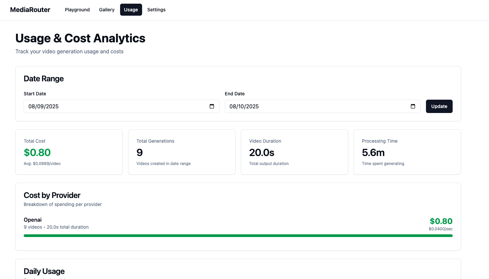

<div align="center">

# 🎬 MediaRouter

### Open Source Video Generation Gateway

**A unified API for multiple AI video generation providers**

[](./LICENSE)
[](https://github.com/samagra14/mediagateway)
[](https://github.com/samagra14/mediagateway/pkgs/container/mediagateway-backend)
[](./CONTRIBUTING.md)

[](https://fastapi.tiangolo.com/)
[](https://reactjs.org/)
[](https://www.python.org/)
[](https://www.typescriptlang.org/)

[Features](#-features) • [Quick Start](#-quick-start) • [Screenshots](#-screenshots) • [Documentation](#-documentation) • [Contributing](#-contributing)

</div>

---

## 🌟 Why MediaRouter?

**Own Your Video Generation Stack** - MediaRouter is the only 100% open source video generation gateway that gives you:

- 🔓 **No Vendor Lock-in**: Switch between Sora, Runway, Kling, and more with a single API
- 🔑 **Bring Your Own Keys**: Your API keys, your data, your control
- 💰 **Cost Transparency**: Real-time cost tracking across all providers
- 🏠 **Run Anywhere**: Docker-based deployment in 30 seconds
- 🛠️ **Fully Customizable**: Add your own providers, modify workflows, extend functionality

> **🎉 Latest**: OpenAI's Sora 2 API support with synced audio generation!

### The Open Source Advantage

Unlike proprietary solutions, MediaRouter gives you:
- ✅ Complete source code access
- ✅ Self-hosted deployment
- ✅ No usage limits or restrictions
- ✅ Community-driven development
- ✅ MIT licensed - use it anywhere

## ✨ Features

- **🔌 Unified API**: Single OpenAI-compatible endpoint for multiple providers
- **🎨 Beautiful Playground**: Modern React UI with shadcn/ui components
- **🔑 BYOK Model**: Bring Your Own Keys - no vendor lock-in
- **🎯 Multiple Providers**: Support for Sora 2, Runway, Kling, and more
- **📊 Usage Tracking**: Monitor costs, generation times, and success rates
- **🎬 Video Gallery**: Browse and manage your generated videos
- **🚀 One Command Setup**: Get started instantly with Docker Compose
- **🔒 Secure**: Encrypted API key storage with industry-standard encryption

## 🎥 Supported Providers

| Provider | Models | Image-to-Video | Audio | API Status | Pricing |
|----------|--------|----------------|-------|------------|---------|
| **OpenAI Sora** | Sora 2, Sora 1 | ✅ | ✅ | ✅ **Public** | $0.10/sec |
| **Runway** | Gen-3, Gen-4 | ✅ | ❌ | ✅ **Public** | Usage-based |
| **Kling AI** | v1.5, v1.0 | ✅ | ❌ | ✅ **Public** | Credit-based |
| Pika Labs | Coming soon | ✅ | - | 🚧 Planned | - |
| Luma Dream Machine | Coming soon | ✅ | - | 🚧 Planned | - |

**All Three Providers Working**: Sora 2, Runway, and Kling all have public APIs available now!

## 🚀 Quick Start

Get MediaRouter running in **3 commands**:

```bash
git clone https://github.com/samagra14/mediagateway.git
cd mediagateway
./setup.sh
```

**That's it! ⚡** The script automatically:
- ✅ Pulls pre-built Docker images (no build time!)
- ✅ Generates secure encryption keys
- ✅ Creates storage directories
- ✅ Starts all services

**Setup time: ~30 seconds**

### 🎯 Next Steps

1. **Open** http://localhost:3000
2. **Add API Keys** → Go to Settings → Add your provider keys
3. **Generate Videos** → Go to Playground → Enter a prompt → Generate!

That's it! You're ready to create videos.

### 📍 Access Points

| Service | URL | Description |
|---------|-----|-------------|
| **Frontend** | http://localhost:3000 | Beautiful web interface |
| **Backend API** | http://localhost:3001 | REST API endpoint |
| **API Docs** | http://localhost:3001/docs | Interactive API documentation |

### 📋 Prerequisites

- [Docker](https://docs.docker.com/get-docker/) installed
- API keys from [supported providers](#getting-api-keys)

### Manual Setup (Without Docker)

#### Backend

```bash
cd backend

# Create virtual environment
python -m venv venv
source venv/bin/activate  # On Windows: venv\Scripts\activate

# Install dependencies
pip install -r requirements.txt

# Create .env file
cp .env.example .env
# Edit .env and add your encryption keys

# Run server
python run.py
```

#### Frontend

```bash
cd frontend

# Install dependencies
npm install

# Run development server
npm run dev
```

## 📖 Usage

### 1. Add API Keys

1. Navigate to **Settings** page
2. Click "Add API Key"
3. Select your provider (OpenAI, Runway, or Kling)
4. Paste your API key
5. Click "Add Key" to validate and save

### 2. Generate Videos

1. Go to the **Playground** page
2. Enter your prompt (e.g., "A serene sunset over mountains")
3. Select your desired model
4. Configure parameters:
   - **Duration**: 1-10 seconds
   - **Aspect Ratio**: 16:9, 9:16, or 1:1
   - **Seed**: Optional, for reproducibility
5. Click "Generate Video"
6. Wait for generation to complete
7. Download or view your video

### 3. Browse Gallery

1. Visit the **Gallery** page
2. View all your generated videos
3. Filter by provider or status
4. Download or delete videos

## 🔌 API Reference

### Generate Video

```bash
POST /v1/video/generations
Content-Type: application/json

{
  "model": "sora-2",
  "prompt": "A serene sunset over mountains",
  "duration": 5,
  "aspect_ratio": "16:9",
  "seed": 12345
}
```

**Response:**

```json
{
  "id": "gen_abc123",
  "object": "video.generation",
  "created": 1728234567,
  "model": "sora-2",
  "provider": "openai",
  "status": "processing",
  "prompt": "A serene sunset over mountains",
  "video": null,
  "usage": null
}
```

### Check Status

```bash
GET /v1/video/generations/{generation_id}
```

### List Generations

```bash
GET /v1/video/generations?limit=50&provider=openai&status=completed
```

### Full API Documentation

Visit http://localhost:3001/docs for interactive API documentation.

## 🔑 Getting API Keys

### OpenAI (Sora)

1. Visit [OpenAI Platform](https://platform.openai.com/)
2. Sign up or log in
3. Navigate to API Keys section
4. Create new API key
5. **Note**: Sora access may require waitlist approval

### Runway

1. Visit [Runway](https://runwayml.com/)
2. Sign up for an account
3. Go to Settings → API Keys
4. Generate new API key

### Kling AI

1. Visit [Kling AI](https://klingai.com/)
2. Create an account
3. Navigate to API section
4. Generate API key

## 🏗️ Architecture

```
mediarouter/
├── backend/                 # FastAPI backend
│   ├── src/
│   │   ├── api/            # API routes and schemas
│   │   ├── providers/      # Provider adapters
│   │   ├── services/       # Business logic
│   │   ├── models/         # Database models
│   │   └── db/             # Database setup
│   ├── requirements.txt
│   └── run.py
├── frontend/               # React frontend
│   ├── src/
│   │   ├── components/    # UI components
│   │   ├── pages/         # Page components
│   │   └── lib/           # Utilities and API client
│   └── package.json
├── storage/               # Video storage
├── docker-compose.yml     # Docker orchestration
└── setup.sh              # Setup script
```

## 🛠️ Development

### Using Pre-built Images (Recommended)

```bash
# Pull latest images and start
docker compose pull
docker compose up -d

# View logs
docker compose logs -f
```

### Building Locally (For Development)

If you want to build from source:

```bash
# Use the local development compose file
docker compose -f docker-compose.local.yml up --build

# Or build manually
docker compose build
docker compose up -d
```

### Backend Development (Without Docker)

```bash
cd backend

# Install dev dependencies
pip install -r requirements.txt

# Run with hot reload
uvicorn src.main:app --reload --port 3001

# Run tests
pytest
```

### Frontend Development (Without Docker)

```bash
cd frontend

# Install dependencies
npm install

# Run dev server
npm run dev

# Build for production
npm run build

# Lint
npm run lint
```

### Adding a New Provider

1. Create a new provider file in `backend/src/providers/`
2. Implement the `VideoProvider` interface
3. Add provider to `PROVIDERS` dict in `__init__.py`
4. Add model mappings to `MODEL_PROVIDER_MAP`
5. Test the provider integration

Example:

```python
# backend/src/providers/newprovider.py
from .base import VideoProvider, VideoRequest, VideoResponse

class NewProvider(VideoProvider):
    @property
    def name(self) -> str:
        return "newprovider"

    @property
    def models(self) -> list[str]:
        return ["model-v1"]

    async def validate_key(self) -> bool:
        # Implement key validation
        pass

    async def generate_video(self, request: VideoRequest) -> VideoResponse:
        # Implement video generation
        pass

    async def check_status(self, job_id: str) -> VideoResponse:
        # Implement status checking
        pass
```

## 🔒 Security

- API keys are encrypted using Fernet (symmetric encryption)
- Encryption keys are stored in `.env` (never commit to git)
- HTTPS recommended for production deployments
- CORS is configured for allowed origins only

## 🐛 Troubleshooting

### Cannot Pull Docker Images

If you see "denied" errors when pulling images:

```bash
# The images might not be public yet, or the build is still running
# Check build status: https://github.com/samagra14/mediagateway/actions

# Option 1: Wait for the build to complete, then try again
docker compose pull

# Option 2: Build locally instead
docker compose -f docker-compose.local.yml up --build
```

### Port Already in Use

```bash
# Stop existing containers
docker compose down

# Check what's using the ports
lsof -i :3000  # Frontend
lsof -i :3001  # Backend

# Or change ports in docker-compose.yml
```

### Database Issues

```bash
# Reset database
rm storage/db.sqlite

# Restart backend
docker compose restart backend
```

### Video Generation Stuck

- Check provider API status
- Verify API key validity in Settings
- Check backend logs: `docker compose logs -f backend`
- Some providers have rate limits
- Sora may require waitlist approval

### Services Not Starting

```bash
# Check logs
docker compose logs

# Restart everything
docker compose down
docker compose up -d

# Check service health
docker compose ps
```

## 📸 Screenshots

### Playground - Generate Videos

*Generate videos with any provider using a beautiful, intuitive interface*

### Gallery - Manage Your Videos

*Browse, filter, and manage all your generated videos in one place*

### Usage Analytics - Track Costs

*Monitor spending, generation times, and success rates across all providers*

### Settings - Manage API Keys

*Securely add and manage API keys for multiple providers*

## 📊 Usage Statistics

View detailed usage statistics in the Settings page:
- Total generations
- Cost breakdown by provider/model
- Average generation times
- Success/failure rates

## 🤝 Contributing

We love contributions! MediaRouter is built by the community, for the community.

### Ways to Contribute

- 🐛 Report bugs and issues
- 💡 Suggest new features or providers
- 📝 Improve documentation
- 🔧 Submit pull requests
- ⭐ Star the repo to show support

### Quick Start for Contributors

1. Fork the repository
2. Create a feature branch (`git checkout -b feature/amazing-feature`)
3. Make your changes
4. Test locally with `docker compose -f docker-compose.local.yml up --build`
5. Commit your changes (`git commit -m 'Add amazing feature'`)
6. Push to the branch (`git push origin feature/amazing-feature`)
7. Open a Pull Request

### Development Guidelines

- Follow existing code style (FastAPI for backend, React for frontend)
- Add tests for new features
- Update documentation
- Ensure Docker builds succeed
- Add provider integrations using the `VideoProvider` interface

See [CLAUDE.md](CLAUDE.md) for detailed development guide.

## 📝 License

This project is licensed under the **MIT License** - see the [LICENSE](LICENSE) file for details.

**What this means:**
- ✅ Commercial use allowed
- ✅ Modification allowed
- ✅ Distribution allowed
- ✅ Private use allowed
- ❌ No warranty provided
- ❌ No liability accepted

## 🌟 Support the Project

If MediaRouter is helpful to you:

- ⭐ **Star this repo** - It helps others discover the project
- 🐦 **Share on social media** - Spread the word
- 💬 **Join discussions** - Share your use cases and ideas
- 🤝 **Contribute** - Code, docs, or ideas welcome
- 🐛 **Report bugs** - Help us improve

## 📞 Community & Support

- 🐛 **Issues**: [GitHub Issues](https://github.com/samagra14/mediagateway/issues)
- 💬 **Discussions**: [GitHub Discussions](https://github.com/samagra14/mediagateway/discussions)
- 📖 **Documentation**: [Full Documentation](./CLAUDE.md)

## 🗺️ Roadmap

### Coming Soon
- [ ] Additional providers (Pika, Luma, Haiper)
- [ ] Image-to-video support
- [ ] Video-to-video transformations
- [ ] Batch generation
- [ ] Webhook notifications
- [ ] CLI tool
- [ ] Python/TypeScript SDKs

### Completed ✅
- [x] Sora 2 API integration
- [x] Runway Gen-3/Gen-4 support
- [x] Kling AI v1.5 support
- [x] Usage tracking and analytics
- [x] Pre-built Docker images
- [x] OpenAI-compatible API

## 🙏 Acknowledgments

Built with amazing open source technologies:
- [FastAPI](https://fastapi.tiangolo.com/) - Modern Python web framework
- [React](https://reactjs.org/) - UI library
- [shadcn/ui](https://ui.shadcn.com/) - Beautiful UI components
- [Tailwind CSS](https://tailwindcss.com/) - Utility-first CSS
- [Docker](https://www.docker.com/) - Containerization

---

<div align="center">

**Built with ❤️ by the open source community**

[⬆ Back to Top](#-mediarouter)

</div>
